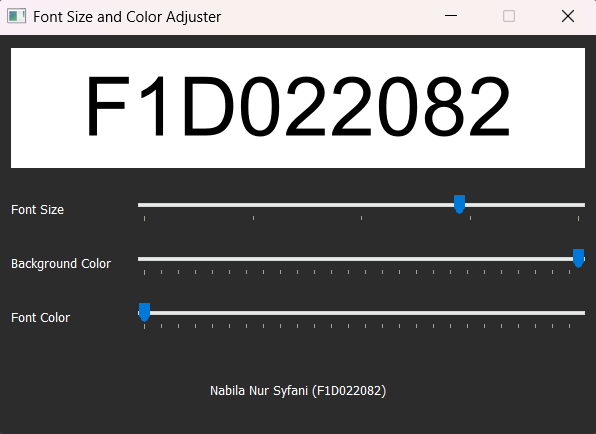
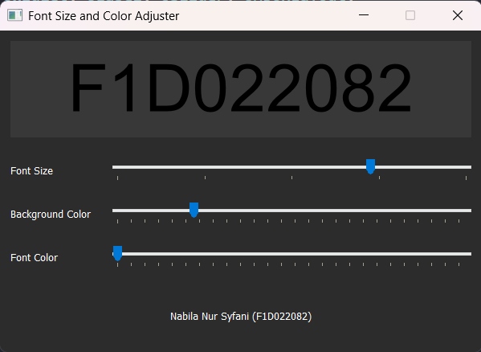
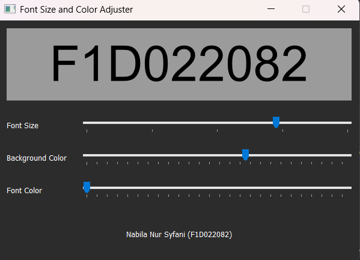
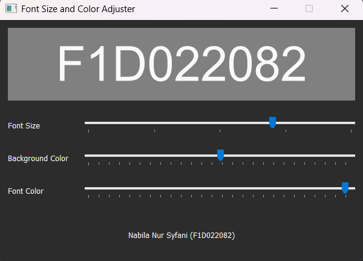
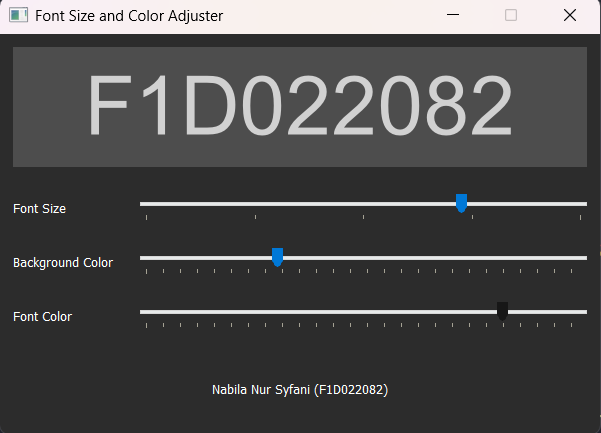

# pv25-week6

<table align="center">
  <tr>
    <td align="center">
      <
" width="400"/> 
      <b>Output ketika salah satu/semua input kosong</b>
    </td>
    <td align="center">
       
      <b>Output ketika nama tidak valid</b>
    </td>
  </tr>
  <tr>
    <td align="center">
       
      <b>Output ketika email tidak valid</b>
    </td>
    <td align="center">
       
      <b>Output ketika usia tidak valid </b>
    </td>
  </tr>
  <tr>
    <td align="center">
       
      <b>Output ketika nomor hp tidak valid </b>
    </td>
    <td align="center">
       
      <b>Output ketika data tersimpan</b>
    </td>
  </tr>
</table>
